# Personal-Portfolio

This repository contains front-end projects built following the roadmap.sh front-end developer path.

## Project List

[Single-Page CV](https://roadmap.sh/projects/single-page-cv), 
[Basic HTML WebSite](https://roadmap.sh/projects/single-page-cv), 
[Personal Portfolio](https://roadmap.sh/projects/portfolio-website), 
[Changelog component](https://roadmap.sh/projects/changelog-component),
[Testimonial Cards](https://roadmap.sh/projects/testimonial-cards),
[Datepicker UI](https://roadmap.sh/projects/datepicker-ui),
[Accessible Form UI](https://roadmap.sh/projects/accessible-form-ui),
[Image Grid Layout](https://roadmap.sh/projects/image-grid),
[Tooltip UI](https://roadmap.sh/projects/tooltip-ui),
[Tabs](https://roadmap.sh/projects/simple-tabs),
[Cookie Consent](https://roadmap.sh/projects/cookie-consent),
[Restricted Textarea](https://roadmap.sh/projects/restricted-textarea),
[Accordion](https://roadmap.sh/projects/accordion),
[Age Calculator](https://roadmap.sh/projects/age-calculator),

<a href="/02-basic-html-website/">
  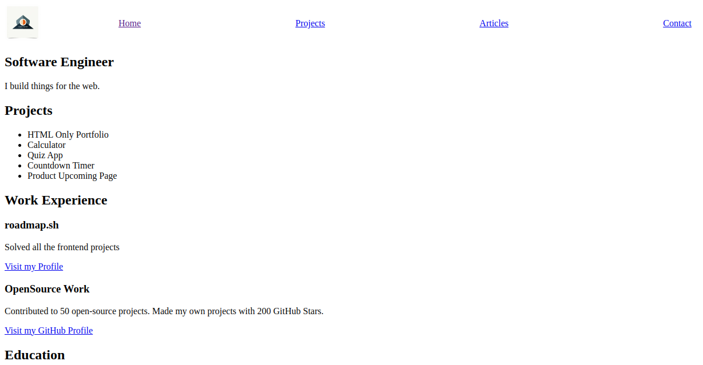 </a>

<a href="/03-personal-portfolio/">
  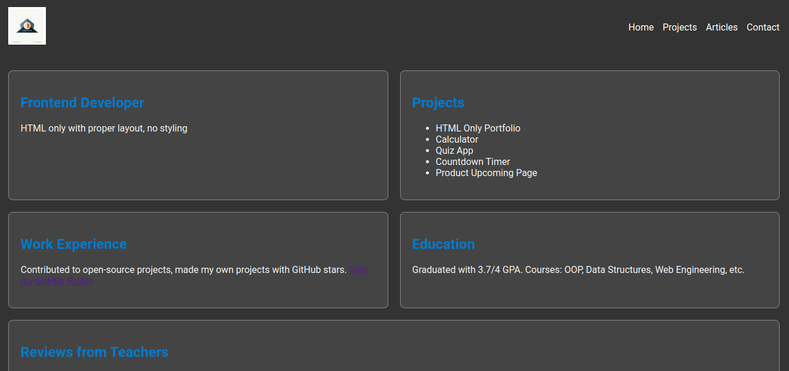 </a>
<a href="/04-changelog-component">
  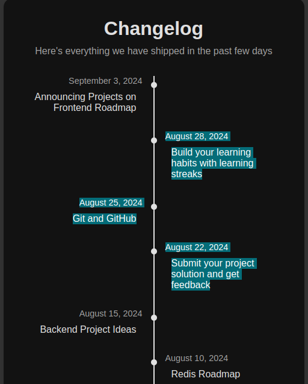 </a>

<a href="/05-testimonial-cards/">
  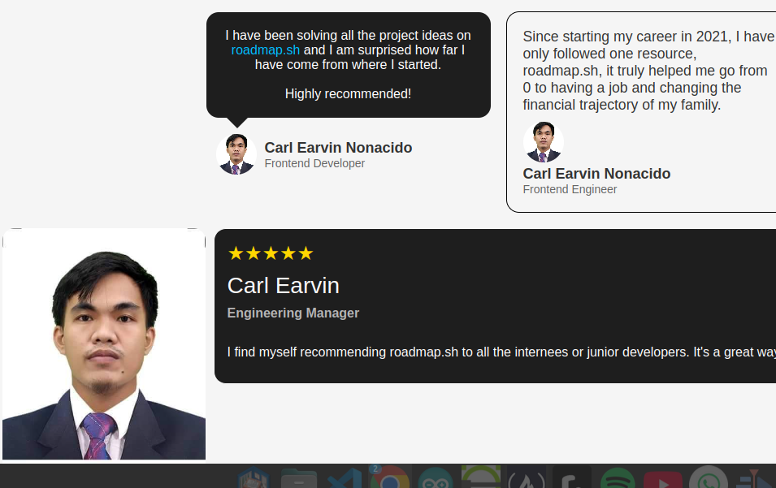 </a>
<a href="/06-datepicker-ui/">
  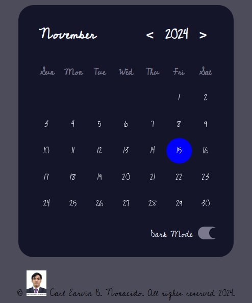
</a>

  <a href="/07-accessible-form-ui/">
    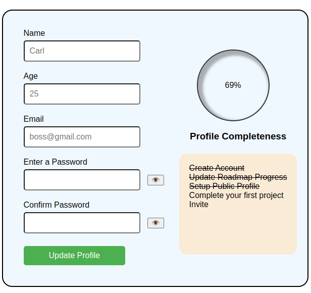
  </a>
  <a href="/08-image-grid-layout/">
    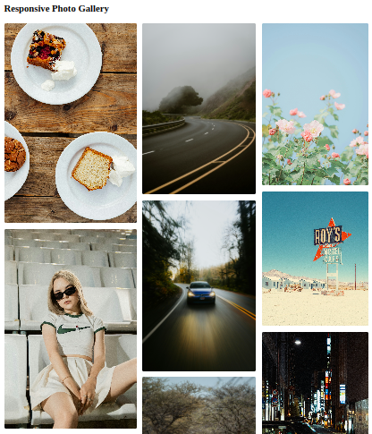
  </a>

  <a href="/09-tooltip-ui/">
      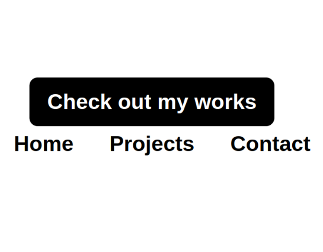
  </a>
  <a href="/10-tabs/">
      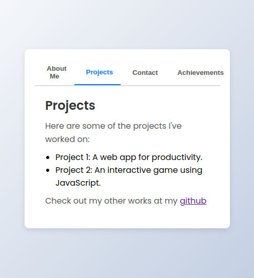
  </a>

  <a href="/11-cookie-consent/">
      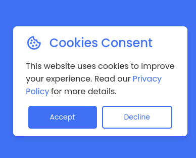
  </a>
  <a href="/12-restricted-textarea/">
      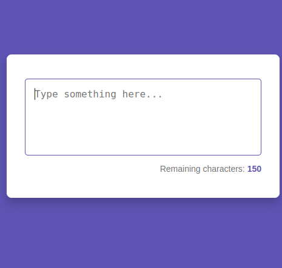
  </a>

  <a href="/13-accordion/">
        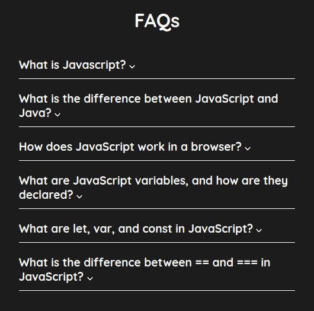
  </a>
  <a href="/14-age-calculator/">
        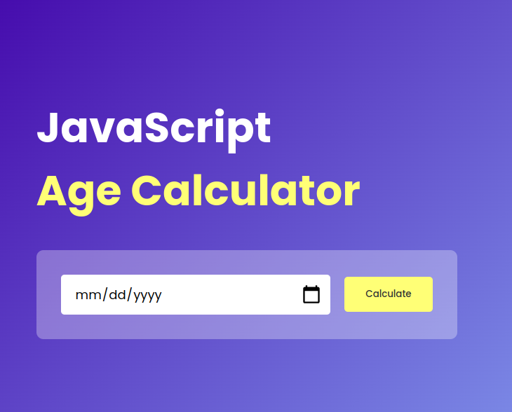
  </a>

